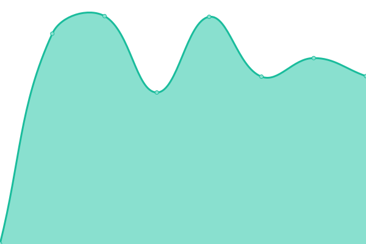

# [📈 Live Status](https://Georgsius.github.io/status): <!--live status--> **🟩 All systems operational**

<!--start: status pages-->
<!-- This summary is generated by Upptime (https://github.com/upptime/upptime) -->
<!-- Do not edit this manually, your changes will be overwritten -->
<!-- prettier-ignore -->
| URL | Status | History | Response Time | Uptime |
| --- | ------ | ------- | ------------- | ------ |
|  [Е-досье](https://e-ecolog.ru) | 🟩 Up | [e-dose.yml](https://github.com/Georgsius/status/commits/HEAD/history/e-dose.yml) | 

 596ms
     
 | 

<a href="https://Georgsius.github.io/status/history/e-dose">100.00%</a>
    

|  [Sendy](https://sendy.e-ecolog.ru) | 🟩 Up | [sendy.yml](https://github.com/Georgsius/status/commits/HEAD/history/sendy.yml) | 

 557ms
     
 | 

<a href="https://Georgsius.github.io/status/history/sendy">100.00%</a>
    

|  [Postal](https://postal.e-ecolog.ru) | 🟩 Up | [postal.yml](https://github.com/Georgsius/status/commits/HEAD/history/postal.yml) | 

 791ms
     
 | 

<a href="https://Georgsius.github.io/status/history/postal">100.00%</a>
    

|  [Спецтранс ЖСК](http://s-z.spb.ru) | 🟩 Up | [specztrans-zh-sk.yml](https://github.com/Georgsius/status/commits/HEAD/history/specztrans-zh-sk.yml) | 

 1549ms
     
 | 

<a href="https://Georgsius.github.io/status/history/specztrans-zh-sk">100.00%</a>
    

|  [AnyQuestion (RU)](https://ru.anyquestion.info/) | 🟩 Up | [any-question-ru.yml](https://github.com/Georgsius/status/commits/HEAD/history/any-question-ru.yml) | 

 739ms
     
 | 

<a href="https://Georgsius.github.io/status/history/any-question-ru">100.00%</a>
    

|  [ANET](https://sovet-kak.ru/) | 🟩 Up | [anet.yml](https://github.com/Georgsius/status/commits/HEAD/history/anet.yml) | 

 647ms
     
 | 

<a href="https://Georgsius.github.io/status/history/anet">100.00%</a>
    

|  Wireguard Personal | 🟩 Up | [wireguard-personal.yml](https://github.com/Georgsius/status/commits/HEAD/history/wireguard-personal.yml) | 

 387ms
     
 | 

<a href="https://Georgsius.github.io/status/history/wireguard-personal">100.00%</a>
    

|  [Brain Bot](https://brainbot.info/) | 🟩 Up | [brain-bot.yml](https://github.com/Georgsius/status/commits/HEAD/history/brain-bot.yml) | 

 661ms
     
 | 

<a href="https://Georgsius.github.io/status/history/brain-bot">99.89%</a>
    

|  Панель управления OpenAI | 🟩 Up | [panel-upravleniya-open-ai.yml](https://github.com/Georgsius/status/commits/HEAD/history/panel-upravleniya-open-ai.yml) | 

 760ms
     
 | 

<a href="https://Georgsius.github.io/status/history/panel-upravleniya-open-ai">100.00%</a>
    

|  [BigDevOps](https://bigdevops.ru/) | 🟩 Up | [big-dev-ops.yml](https://github.com/Georgsius/status/commits/HEAD/history/big-dev-ops.yml) | 

 1043ms
     
 | 

<a href="https://Georgsius.github.io/status/history/big-dev-ops">100.00%</a>
    

|  [Вопрос Как](https://vopros-kak.ru/) | 🟩 Up | [vopros-kak.yml](https://github.com/Georgsius/status/commits/HEAD/history/vopros-kak.yml) | 

 1084ms
     
 | 

<a href="https://Georgsius.github.io/status/history/vopros-kak">100.00%</a>
    

|  Панель управления OpenAI (GW) | 🟩 Up | [panel-upravleniya-open-ai-gw.yml](https://github.com/Georgsius/status/commits/HEAD/history/panel-upravleniya-open-ai-gw.yml) | 

 996ms
     
 | 

<a href="https://Georgsius.github.io/status/history/panel-upravleniya-open-ai-gw">100.00%</a>
    

|  [GroupWeb](https://groupweb.ru/) | 🟩 Up | [group-web.yml](https://github.com/Georgsius/status/commits/HEAD/history/group-web.yml) | 

 777ms
     
 | 

<a href="https://Georgsius.github.io/status/history/group-web">100.00%</a>
    

|  [BiBiBus](https://bibibus.ru/) | 🟩 Up | [bi-bi-bus.yml](https://github.com/Georgsius/status/commits/HEAD/history/bi-bi-bus.yml) | 

 863ms
     
 | 

<a href="https://Georgsius.github.io/status/history/bi-bi-bus">100.00%</a>
    

|  [TrustyTalk](https://trustytalk.com/) | 🟩 Up | [trusty-talk.yml](https://github.com/Georgsius/status/commits/HEAD/history/trusty-talk.yml) | 

 1254ms
     
 | 

<a href="https://Georgsius.github.io/status/history/trusty-talk">100.00%</a>
    

<!--end: status pages-->
