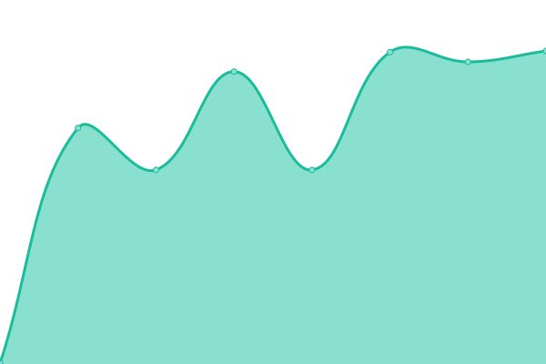
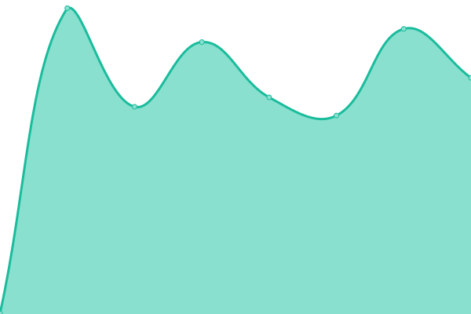
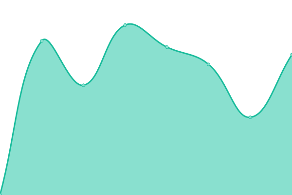

# [📈 Live Status](https://Georgsius.github.io/status): <!--live status--> **🟧 Partial outage**

This repository contains the open-source uptime monitor and status page for [Georgsius](https://Georgsius.github.io/status), powered by [Upptime](https://github.com/upptime/upptime).

With [Upptime](https://upptime.js.org), you can get your own unlimited and free uptime monitor and status page, powered entirely by a GitHub repository. We use [Issues](https://github.com/Georgsius/status/issues) as incident reports, [Actions](https://github.com/Georgsius/status/actions) as uptime monitors, and [Pages](https://Georgsius.github.io/status) for the status page.

<!--start: status pages-->
<!-- This summary is generated by Upptime (https://github.com/upptime/upptime) -->
<!-- Do not edit this manually, your changes will be overwritten -->
<!-- prettier-ignore -->
| URL | Status | History | Response Time | Uptime |
| --- | ------ | ------- | ------------- | ------ |
|  [Е-досье](https://e-ecolog.ru) | 🟩 Up | [e-dose.yml](https://github.com/Georgsius/status/commits/HEAD/history/e-dose.yml) | 

 740ms
     
 | 

<a href="https://Georgsius.github.io/status/history/e-dose">99.77%</a>
    

|  [Спецтранс ЖСК](http://s-z.spb.ru) | 🟩 Up | [specztrans-zh-sk.yml](https://github.com/Georgsius/status/commits/HEAD/history/specztrans-zh-sk.yml) | 

 1273ms
     
 | 

<a href="https://Georgsius.github.io/status/history/specztrans-zh-sk">99.56%</a>
    

|  ML WIKI I LOVE MAIN | 🟥 Down | [ml-wiki-i-love-main.yml](https://github.com/Georgsius/status/commits/HEAD/history/ml-wiki-i-love-main.yml) | 

 271ms
     
 | 

<a href="https://Georgsius.github.io/status/history/ml-wiki-i-love-main">99.28%</a>
    

|  ML WIKI I LOVE RU | 🟥 Down | [ml-wiki-i-love-ru.yml](https://github.com/Georgsius/status/commits/HEAD/history/ml-wiki-i-love-ru.yml) | 

 271ms
     
 | 

<a href="https://Georgsius.github.io/status/history/ml-wiki-i-love-ru">99.28%</a>
    

|  ML WIKI ASIA | 🟥 Down | [ml-wiki-asia.yml](https://github.com/Georgsius/status/commits/HEAD/history/ml-wiki-asia.yml) | 

 430ms
     
 | 

<a href="https://Georgsius.github.io/status/history/ml-wiki-asia">99.28%</a>
    

<!--end: status pages-->

[**Visit our status website →**](https://Georgsius.github.io/status)

## 📄 License

- Powered by: [Upptime](https://github.com/upptime/upptime)
- Code: [MIT](./LICENSE) © [Georgsius](https://Georgsius.github.io/status)
- Data in the `./history` directory: [Open Database License](https://opendatacommons.org/licenses/odbl/1-0/)
