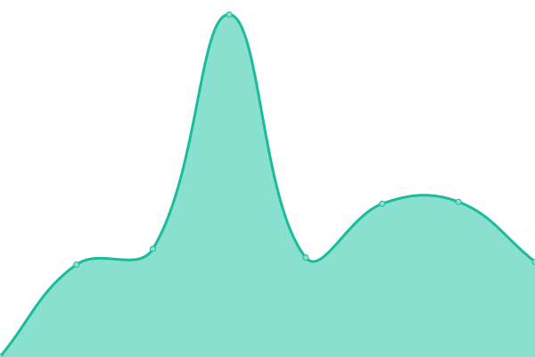
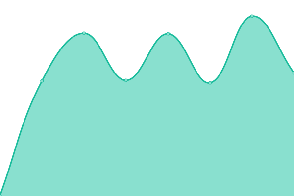
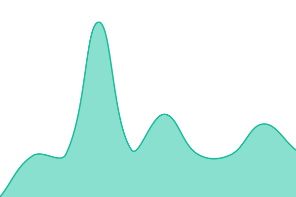
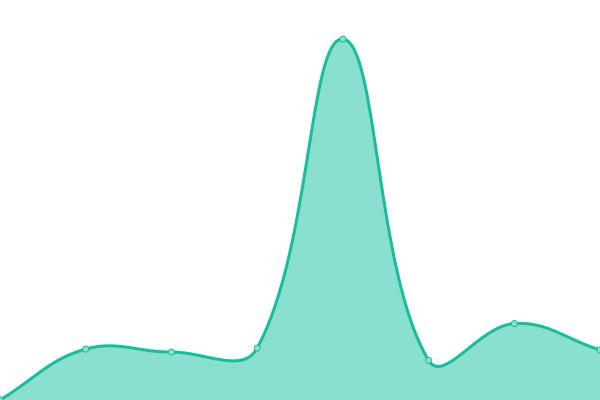
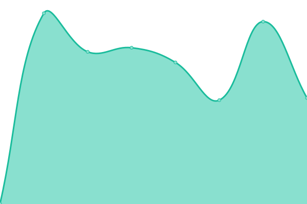

# [📈 Live Status](https://Georgsius.github.io/status): <!--live status--> **🟧 Partial outage**

<!--start: status pages-->
<!-- This summary is generated by Upptime (https://github.com/upptime/upptime) -->
<!-- Do not edit this manually, your changes will be overwritten -->
<!-- prettier-ignore -->
| URL | Status | History | Response Time | Uptime |
| --- | ------ | ------- | ------------- | ------ |
|  [Е-досье](https://e-ecolog.ru) | 🟩 Up | [e-dose.yml](https://github.com/Georgsius/status/commits/HEAD/history/e-dose.yml) | 

 1482ms
     
 | 

<a href="https://Georgsius.github.io/status/history/e-dose">100.00%</a>
    

|  [Sendy](https://sendy.e-ecolog.ru) | 🟩 Up | [sendy.yml](https://github.com/Georgsius/status/commits/HEAD/history/sendy.yml) | 

 713ms
     
 | 

<a href="https://Georgsius.github.io/status/history/sendy">100.00%</a>
    

|  [Postal](https://postal.e-ecolog.ru) | 🟩 Up | [postal.yml](https://github.com/Georgsius/status/commits/HEAD/history/postal.yml) | 

 1539ms
     
 | 

<a href="https://Georgsius.github.io/status/history/postal">100.00%</a>
    

|  Wireguard Personal | 🟩 Up | [wireguard-personal.yml](https://github.com/Georgsius/status/commits/HEAD/history/wireguard-personal.yml) | 

 365ms
     
 | 

<a href="https://Georgsius.github.io/status/history/wireguard-personal">98.34%</a>
    

|  [Brain Bot](https://brainbot.info/) | 🟩 Up | [brain-bot.yml](https://github.com/Georgsius/status/commits/HEAD/history/brain-bot.yml) | 

 549ms
     
 | 

<a href="https://Georgsius.github.io/status/history/brain-bot">98.39%</a>
    

|  [TrustyTalk](https://trustytalk.com/) | 🟩 Up | [trusty-talk.yml](https://github.com/Georgsius/status/commits/HEAD/history/trusty-talk.yml) | 

 1817ms
     
 | 

<a href="https://Georgsius.github.io/status/history/trusty-talk">100.00%</a>
    

|  [TrustyTalk Telegram](https://t.trustytalk.com/up) | 🟩 Up | [trusty-talk-telegram.yml](https://github.com/Georgsius/status/commits/HEAD/history/trusty-talk-telegram.yml) | 

 700ms
     
 | 

<a href="https://Georgsius.github.io/status/history/trusty-talk-telegram">100.00%</a>
    

|  [Thumbor TT](http://80.76.60.25/healthcheck) | 🟩 Up | [thumbor-tt.yml](https://github.com/Georgsius/status/commits/HEAD/history/thumbor-tt.yml) | 

 318ms
     
 | 

<a href="https://Georgsius.github.io/status/history/thumbor-tt">100.00%</a>
    

|  [Image Bucket TT](https://b.trustytalk.com/robots.txt) | 🟩 Up | [image-bucket-tt.yml](https://github.com/Georgsius/status/commits/HEAD/history/image-bucket-tt.yml) | 

 1524ms
     
 | 

<a href="https://Georgsius.github.io/status/history/image-bucket-tt">100.00%</a>
    

|  [Atom](https://online-wars.ru/up) | 🟩 Up | [atom.yml](https://github.com/Georgsius/status/commits/HEAD/history/atom.yml) | 

 758ms
     
 | 

<a href="https://Georgsius.github.io/status/history/atom">100.00%</a>
    

|  [DEV Balagan](https://dev.playbalagan.com/up) | 🟥 Down | [dev-balagan.yml](https://github.com/Georgsius/status/commits/HEAD/history/dev-balagan.yml) | 

 668ms
     
 | 

<a href="https://Georgsius.github.io/status/history/dev-balagan">0.00%</a>
    

|  [АртЭко](https://artecospb.ru/up) | 🟩 Up | [art-eko.yml](https://github.com/Georgsius/status/commits/HEAD/history/art-eko.yml) | 

 1454ms
     
 | 

<a href="https://Georgsius.github.io/status/history/art-eko">100.00%</a>
    

|  [DEV CosmoDocs](https://dev.cosmodocs.ru) | 🟥 Down | [dev-cosmo-docs.yml](https://github.com/Georgsius/status/commits/HEAD/history/dev-cosmo-docs.yml) | 

 0ms
     
 | 

<a href="https://Georgsius.github.io/status/history/dev-cosmo-docs">0.00%</a>
    

|  [Библиофан](https://bibliofan.ru/up) | 🟩 Up | [bibliofan.yml](https://github.com/Georgsius/status/commits/HEAD/history/bibliofan.yml) | 

 728ms
     
 | 

<a href="https://Georgsius.github.io/status/history/bibliofan">100.00%</a>
    

|  [S3 Библиофан](https://i.bibliofan.ru/ping.txt) | 🟩 Up | [s3-bibliofan.yml](https://github.com/Georgsius/status/commits/HEAD/history/s3-bibliofan.yml) | 

 1575ms
     
 | 

<a href="https://Georgsius.github.io/status/history/s3-bibliofan">100.00%</a>
    

|  [Фиджики](https://fidg.ru/up) | 🟩 Up | [fidzhiki.yml](https://github.com/Georgsius/status/commits/HEAD/history/fidzhiki.yml) | 

 741ms
     
 | 

<a href="https://Georgsius.github.io/status/history/fidzhiki">100.00%</a>
    

|  [Пиксвет](https://piksvet.ru/up) | 🟩 Up | [piksvet.yml](https://github.com/Georgsius/status/commits/HEAD/history/piksvet.yml) | 

 735ms
     
 | 

<a href="https://Georgsius.github.io/status/history/piksvet">100.00%</a>
    

|  [Эликсир](https://elixirai.ru/up) | 🟩 Up | [eliksir.yml](https://github.com/Georgsius/status/commits/HEAD/history/eliksir.yml) | 

 2018ms
     
 | 

<a href="https://Georgsius.github.io/status/history/eliksir">100.00%</a>
    

<!--end: status pages-->
