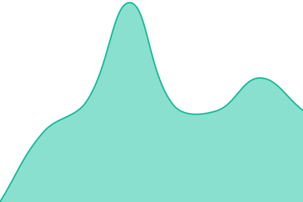
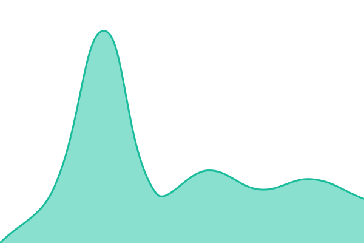
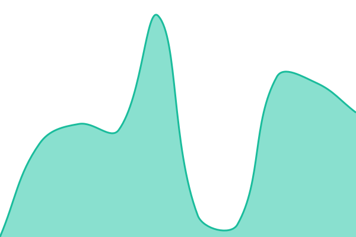

# [📈 Live Status](https://Georgsius.github.io/status): <!--live status--> **🟩 All systems operational**

<!--start: status pages-->
<!-- This summary is generated by Upptime (https://github.com/upptime/upptime) -->
<!-- Do not edit this manually, your changes will be overwritten -->
<!-- prettier-ignore -->
| URL | Status | History | Response Time | Uptime |
| --- | ------ | ------- | ------------- | ------ |
|  [Е-досье](https://e-ecolog.ru) | 🟩 Up | [e-dose.yml](https://github.com/Georgsius/status/commits/HEAD/history/e-dose.yml) | 

 792ms
     
 | 

<a href="https://Georgsius.github.io/status/history/e-dose">100.00%</a>
    

|  [Postal](https://postal.e-ecolog.ru) | 🟩 Up | [postal.yml](https://github.com/Georgsius/status/commits/HEAD/history/postal.yml) | 

 1177ms
     
 | 

<a href="https://Georgsius.github.io/status/history/postal">100.00%</a>
    

|  Wireguard Personal | 🟩 Up | [wireguard-personal.yml](https://github.com/Georgsius/status/commits/HEAD/history/wireguard-personal.yml) | 

 326ms
     
 | 

<a href="https://Georgsius.github.io/status/history/wireguard-personal">100.00%</a>
    

|  [Brain Bot](https://brainbot.info/) | 🟩 Up | [brain-bot.yml](https://github.com/Georgsius/status/commits/HEAD/history/brain-bot.yml) | 

 515ms
     
 | 

<a href="https://Georgsius.github.io/status/history/brain-bot">100.00%</a>
    

|  [АртЭко](https://artecospb.ru/up) | 🟩 Up | [art-eko.yml](https://github.com/Georgsius/status/commits/HEAD/history/art-eko.yml) | 

 772ms
     
 | 

<a href="https://Georgsius.github.io/status/history/art-eko">100.00%</a>
    

|  [Библиофан](https://bibliofan.ru/up) | 🟩 Up | [bibliofan.yml](https://github.com/Georgsius/status/commits/HEAD/history/bibliofan.yml) | 

 747ms
     
 | 

<a href="https://Georgsius.github.io/status/history/bibliofan">100.00%</a>
    

|  [S3 Библиофан](https://i.bibliofan.ru/ping.txt) | 🟩 Up | [s3-bibliofan.yml](https://github.com/Georgsius/status/commits/HEAD/history/s3-bibliofan.yml) | 

 1191ms
     
 | 

<a href="https://Georgsius.github.io/status/history/s3-bibliofan">100.00%</a>
    

|  [Фиджики](https://fidg.ru/up) | 🟩 Up | [fidzhiki.yml](https://github.com/Georgsius/status/commits/HEAD/history/fidzhiki.yml) | 

 1208ms
     
 | 

<a href="https://Georgsius.github.io/status/history/fidzhiki">100.00%</a>
    

|  [3D-бот](https://bot3d.ru/up) | 🟩 Up | [3-d-bot.yml](https://github.com/Georgsius/status/commits/HEAD/history/3-d-bot.yml) | 

 909ms
     
 | 

<a href="https://Georgsius.github.io/status/history/3-d-bot">100.00%</a>
    

|  [Буква](https://bukva.ai/up) | 🟩 Up | [bukva.yml](https://github.com/Georgsius/status/commits/HEAD/history/bukva.yml) | 

 772ms
     
 | 

<a href="https://Georgsius.github.io/status/history/bukva">100.00%</a>
    

|  [Радиопедия](https://radiopaedia.ru/up) | 🟩 Up | [radiopediya.yml](https://github.com/Georgsius/status/commits/HEAD/history/radiopediya.yml) | 

 1065ms
     
 | 

<a href="https://Georgsius.github.io/status/history/radiopediya">100.00%</a>
    

|  BAMBUDDY | 🟩 Up | [bambuddy.yml](https://github.com/Georgsius/status/commits/HEAD/history/bambuddy.yml) | 

 772ms
     
 | 

<a href="https://Georgsius.github.io/status/history/bambuddy">98.96%</a>
    

|  DC | 🟩 Up | [dc.yml](https://github.com/Georgsius/status/commits/HEAD/history/dc.yml) | 

 503ms
     
 | 

<a href="https://Georgsius.github.io/status/history/dc">100.00%</a>
    

<!--end: status pages-->
