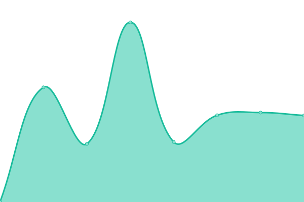
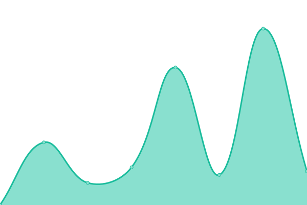

# [📈 Live Status](https://Georgsius.github.io/status): <!--live status--> **🟩 All systems operational**

<!--start: status pages-->
<!-- This summary is generated by Upptime (https://github.com/upptime/upptime) -->
<!-- Do not edit this manually, your changes will be overwritten -->
<!-- prettier-ignore -->
| URL | Status | History | Response Time | Uptime |
| --- | ------ | ------- | ------------- | ------ |
|  [Е-досье](https://e-ecolog.ru) | 🟩 Up | [e-dose.yml](https://github.com/Georgsius/status/commits/HEAD/history/e-dose.yml) | 

 2180ms
     
 | 

<a href="https://Georgsius.github.io/status/history/e-dose">99.37%</a>
    

|  [Sendy](https://sendy.e-ecolog.ru) | 🟩 Up | [sendy.yml](https://github.com/Georgsius/status/commits/HEAD/history/sendy.yml) | 

 1122ms
     
 | 

<a href="https://Georgsius.github.io/status/history/sendy">99.38%</a>
    

|  [Postal](https://postal.e-ecolog.ru) | 🟩 Up | [postal.yml](https://github.com/Georgsius/status/commits/HEAD/history/postal.yml) | 

 1888ms
     
 | 

<a href="https://Georgsius.github.io/status/history/postal">99.43%</a>
    

|  Wireguard Personal | 🟩 Up | [wireguard-personal.yml](https://github.com/Georgsius/status/commits/HEAD/history/wireguard-personal.yml) | 

 311ms
     
 | 

<a href="https://Georgsius.github.io/status/history/wireguard-personal">100.00%</a>
    

|  [Brain Bot](https://brainbot.info/) | 🟩 Up | [brain-bot.yml](https://github.com/Georgsius/status/commits/HEAD/history/brain-bot.yml) | 

 588ms
     
 | 

<a href="https://Georgsius.github.io/status/history/brain-bot">100.00%</a>
    

|  Панель управления OpenAI | 🟩 Up | [panel-upravleniya-open-ai.yml](https://github.com/Georgsius/status/commits/HEAD/history/panel-upravleniya-open-ai.yml) | 

 1146ms
     
 | 

<a href="https://Georgsius.github.io/status/history/panel-upravleniya-open-ai">99.43%</a>
    

|  [TrustyTalk](https://trustytalk.com/) | 🟩 Up | [trusty-talk.yml](https://github.com/Georgsius/status/commits/HEAD/history/trusty-talk.yml) | 

 1399ms
     
 | 

<a href="https://Georgsius.github.io/status/history/trusty-talk">99.49%</a>
    

|  [TrustyTalk Telegram](https://t.trustytalk.com/up) | 🟩 Up | [trusty-talk-telegram.yml](https://github.com/Georgsius/status/commits/HEAD/history/trusty-talk-telegram.yml) | 

 1080ms
     
 | 

<a href="https://Georgsius.github.io/status/history/trusty-talk-telegram">99.49%</a>
    

|  [Thumbor TT](http://80.76.60.25/healthcheck) | 🟩 Up | [thumbor-tt.yml](https://github.com/Georgsius/status/commits/HEAD/history/thumbor-tt.yml) | 

 263ms
     
 | 

<a href="https://Georgsius.github.io/status/history/thumbor-tt">99.50%</a>
    

|  [Image Bucket TT](https://b.trustytalk.com/robots.txt) | 🟩 Up | [image-bucket-tt.yml](https://github.com/Georgsius/status/commits/HEAD/history/image-bucket-tt.yml) | 

 1676ms
     
 | 

<a href="https://Georgsius.github.io/status/history/image-bucket-tt">99.43%</a>
    

|  [Atom](https://online-wars.ru/up) | 🟩 Up | [atom.yml](https://github.com/Georgsius/status/commits/HEAD/history/atom.yml) | 

 1070ms
     
 | 

<a href="https://Georgsius.github.io/status/history/atom">99.44%</a>
    

|  [Tinyp](147.45.227.73) | 🟩 Up | [tinyp.yml](https://github.com/Georgsius/status/commits/HEAD/history/tinyp.yml) | 

 103ms
     
 | 

<a href="https://Georgsius.github.io/status/history/tinyp">100.00%</a>
    

|  [DEV Balagan](https://dev.playbalagan.com/up) | 🟩 Up | [dev-balagan.yml](https://github.com/Georgsius/status/commits/HEAD/history/dev-balagan.yml) | 

 683ms
     
 | 

<a href="https://Georgsius.github.io/status/history/dev-balagan">99.45%</a>
    

|  [TG Agents](https://tgagents.net/up) | 🟩 Up | [tg-agents.yml](https://github.com/Georgsius/status/commits/HEAD/history/tg-agents.yml) | 

 614ms
     
 | 

<a href="https://Georgsius.github.io/status/history/tg-agents">100.00%</a>
    

|  [햃혝햜햨쬫(https://artecospb.ru/up) | 🟩 Up | [art-eko.yml](https://github.com/Georgsius/status/commits/HEAD/history/art-eko.yml) | 

 809ms
     
 | 

<a href="https://Georgsius.github.io/status/history/art-eko">99.46%</a>
    

|  [AiPush.Bid](https://aipush.bid/up) | 🟩 Up | [ai-push-bid.yml](https://github.com/Georgsius/status/commits/HEAD/history/ai-push-bid.yml) | 

 698ms
     
 | 

<a href="https://Georgsius.github.io/status/history/ai-push-bid">100.00%</a>
    

|  [DEV CosmoDocs](https://dev.cosmodocs.ru) | 🟩 Up | [dev-cosmo-docs.yml](https://github.com/Georgsius/status/commits/HEAD/history/dev-cosmo-docs.yml) | 

 1366ms
     
 | 

<a href="https://Georgsius.github.io/status/history/dev-cosmo-docs">100.00%</a>
    

|  [Библиофан](https://bibliofan.ru/up) | 🟩 Up | [bibliofan.yml](https://github.com/Georgsius/status/commits/HEAD/history/bibliofan.yml) | 

 851ms
     
 | 

<a href="https://Georgsius.github.io/status/history/bibliofan">99.46%</a>
    

<!--end: status pages-->
