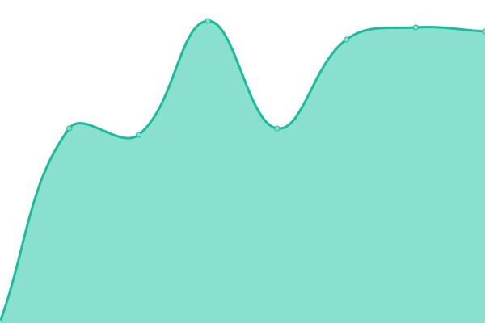

# [📈 Live Status](https://Georgsius.github.io/status): <!--live status--> **🟩 All systems operational**

<!--start: status pages-->
<!-- This summary is generated by Upptime (https://github.com/upptime/upptime) -->
<!-- Do not edit this manually, your changes will be overwritten -->
<!-- prettier-ignore -->
| URL | Status | History | Response Time | Uptime |
| --- | ------ | ------- | ------------- | ------ |
|  [Е-досье](https://e-ecolog.ru) | 🟩 Up | [e-dose.yml](https://github.com/Georgsius/status/commits/HEAD/history/e-dose.yml) | 

 532ms
     
 | 

<a href="https://Georgsius.github.io/status/history/e-dose">100.00%</a>
    

|  [Sendy](https://sendy.e-ecolog.ru) | 🟩 Up | [sendy.yml](https://github.com/Georgsius/status/commits/HEAD/history/sendy.yml) | 

 578ms
     
 | 

<a href="https://Georgsius.github.io/status/history/sendy">100.00%</a>
    

|  [Postal](https://postal.e-ecolog.ru) | 🟩 Up | [postal.yml](https://github.com/Georgsius/status/commits/HEAD/history/postal.yml) | 

 810ms
     
 | 

<a href="https://Georgsius.github.io/status/history/postal">100.00%</a>
    

|  [Спецтранс ЖСК](http://s-z.spb.ru) | 🟩 Up | [specztrans-zh-sk.yml](https://github.com/Georgsius/status/commits/HEAD/history/specztrans-zh-sk.yml) | 

 1296ms
     
 | 

<a href="https://Georgsius.github.io/status/history/specztrans-zh-sk">100.00%</a>
    

|  Wireguard Personal | 🟩 Up | [wireguard-personal.yml](https://github.com/Georgsius/status/commits/HEAD/history/wireguard-personal.yml) | 

 334ms
     
 | 

<a href="https://Georgsius.github.io/status/history/wireguard-personal">100.00%</a>
    

|  [Brain Bot](https://brainbot.info/) | 🟩 Up | [brain-bot.yml](https://github.com/Georgsius/status/commits/HEAD/history/brain-bot.yml) | 

 597ms
     
 | 

<a href="https://Georgsius.github.io/status/history/brain-bot">99.81%</a>
    

|  Панель управления OpenAI | 🟩 Up | [panel-upravleniya-open-ai.yml](https://github.com/Georgsius/status/commits/HEAD/history/panel-upravleniya-open-ai.yml) | 

 885ms
     
 | 

<a href="https://Georgsius.github.io/status/history/panel-upravleniya-open-ai">100.00%</a>
    

|  [TrustyTalk](https://trustytalk.com/) | 🟩 Up | [trusty-talk.yml](https://github.com/Georgsius/status/commits/HEAD/history/trusty-talk.yml) | 

 1087ms
     
 | 

<a href="https://Georgsius.github.io/status/history/trusty-talk">100.00%</a>
    

|  [Thumbor TT](http://80.76.60.25/healthcheck) | 🟩 Up | [thumbor-tt.yml](https://github.com/Georgsius/status/commits/HEAD/history/thumbor-tt.yml) | 

 291ms
     
 | 

<a href="https://Georgsius.github.io/status/history/thumbor-tt">100.00%</a>
    

|  [Image Bucket TT](https://b.trustytalk.com/robots.txt) | 🟩 Up | [image-bucket-tt.yml](https://github.com/Georgsius/status/commits/HEAD/history/image-bucket-tt.yml) | 

 1246ms
     
 | 

<a href="https://Georgsius.github.io/status/history/image-bucket-tt">100.00%</a>
    

|  [Atom](https://online-wars.ru/up) | 🟩 Up | [atom.yml](https://github.com/Georgsius/status/commits/HEAD/history/atom.yml) | 

 809ms
     
 | 

<a href="https://Georgsius.github.io/status/history/atom">100.00%</a>
    

|  [DEV DC](https://dwarf.crzy.ru/up) | 🟩 Up | [dev-dc.yml](https://github.com/Georgsius/status/commits/HEAD/history/dev-dc.yml) | 

 839ms
     
 | 

<a href="https://Georgsius.github.io/status/history/dev-dc">100.00%</a>
    

|  [Dwarf Capital](https://dwarf.capital/up) | 🟩 Up | [dwarf-capital.yml](https://github.com/Georgsius/status/commits/HEAD/history/dwarf-capital.yml) | 

 835ms
     
 | 

<a href="https://Georgsius.github.io/status/history/dwarf-capital">100.00%</a>
    

|  [Tinyp](147.45.227.73) | 🟩 Up | [tinyp.yml](https://github.com/Georgsius/status/commits/HEAD/history/tinyp.yml) | 

 111ms
     
 | 

<a href="https://Georgsius.github.io/status/history/tinyp">100.00%</a>
    

|  SP | 🟩 Up | [sp.yml](https://github.com/Georgsius/status/commits/HEAD/history/sp.yml) | 

 661ms
     
 | 

<a href="https://Georgsius.github.io/status/history/sp">100.00%</a>
    

<!--end: status pages-->
