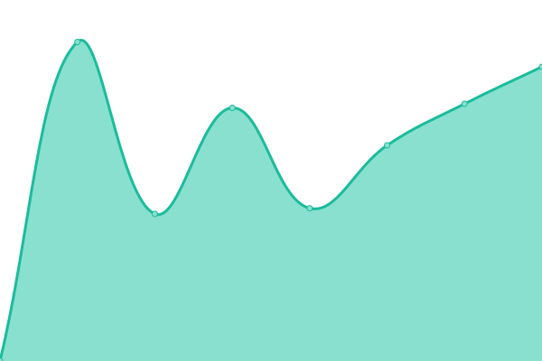

# [📈 Live Status](https://Georgsius.github.io/status): <!--live status--> **🟩 All systems operational**

<!--start: status pages-->
<!-- This summary is generated by Upptime (https://github.com/upptime/upptime) -->
<!-- Do not edit this manually, your changes will be overwritten -->
<!-- prettier-ignore -->
| URL | Status | History | Response Time | Uptime |
| --- | ------ | ------- | ------------- | ------ |
|  [Е-досье](https://e-ecolog.ru) | 🟩 Up | [e-dose.yml](https://github.com/Georgsius/status/commits/HEAD/history/e-dose.yml) | 

 4710ms
     
 | 

<a href="https://Georgsius.github.io/status/history/e-dose">97.54%</a>
    

|  [Sendy](https://sendy.e-ecolog.ru) | 🟩 Up | [sendy.yml](https://github.com/Georgsius/status/commits/HEAD/history/sendy.yml) | 

 4213ms
     
 | 

<a href="https://Georgsius.github.io/status/history/sendy">98.53%</a>
    

|  [Postal](https://postal.e-ecolog.ru) | 🟩 Up | [postal.yml](https://github.com/Georgsius/status/commits/HEAD/history/postal.yml) | 

 832ms
     
 | 

<a href="https://Georgsius.github.io/status/history/postal">99.40%</a>
    

|  [Спецтранс ЖСК](http://s-z.spb.ru) | 🟩 Up | [specztrans-zh-sk.yml](https://github.com/Georgsius/status/commits/HEAD/history/specztrans-zh-sk.yml) | 

 1410ms
     
 | 

<a href="https://Georgsius.github.io/status/history/specztrans-zh-sk">100.00%</a>
    

|  [AnyQuestion (RU)](https://ru.anyquestion.info/) | 🟩 Up | [any-question-ru.yml](https://github.com/Georgsius/status/commits/HEAD/history/any-question-ru.yml) | 

 2890ms
     
 | 

<a href="https://Georgsius.github.io/status/history/any-question-ru">99.23%</a>
    

|  [ANET](https://sovet-kak.ru/) | 🟩 Up | [anet.yml](https://github.com/Georgsius/status/commits/HEAD/history/anet.yml) | 

 755ms
     
 | 

<a href="https://Georgsius.github.io/status/history/anet">100.00%</a>
    

|  Wireguard Personal | 🟩 Up | [wireguard-personal.yml](https://github.com/Georgsius/status/commits/HEAD/history/wireguard-personal.yml) | 

 378ms
     
 | 

<a href="https://Georgsius.github.io/status/history/wireguard-personal">100.00%</a>
    

|  [Brain Bot](https://brainbot.info/) | 🟩 Up | [brain-bot.yml](https://github.com/Georgsius/status/commits/HEAD/history/brain-bot.yml) | 

 659ms
     
 | 

<a href="https://Georgsius.github.io/status/history/brain-bot">100.00%</a>
    

|  Панель управления OpenAI | 🟩 Up | [panel-upravleniya-open-ai.yml](https://github.com/Georgsius/status/commits/HEAD/history/panel-upravleniya-open-ai.yml) | 

 2510ms
     
 | 

<a href="https://Georgsius.github.io/status/history/panel-upravleniya-open-ai">97.59%</a>
    

|  [BigDevOps](https://bigdevops.ru/) | 🟩 Up | [big-dev-ops.yml](https://github.com/Georgsius/status/commits/HEAD/history/big-dev-ops.yml) | 

 1470ms
     
 | 

<a href="https://Georgsius.github.io/status/history/big-dev-ops">99.77%</a>
    

<!--end: status pages-->
